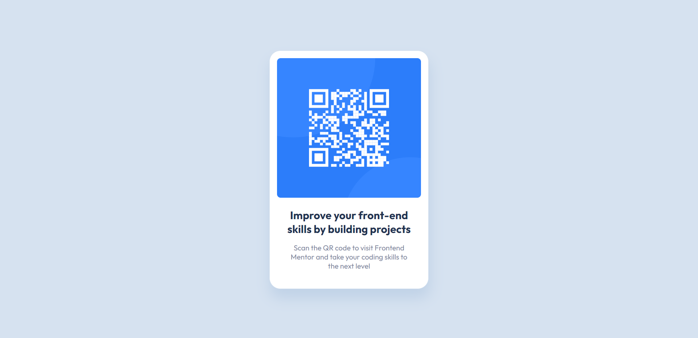

# Frontend Mentor - QR code component solution

This is a solution to the [QR code component challenge on Frontend Mentor](https://www.frontendmentor.io/challenges/qr-code-component-iux_sIO_H). Frontend Mentor challenges help you improve your coding skills by building realistic projects. 

## Table of contents

- [Overview](#overview)
  - [Screenshot](#screenshot)
- [My process](#my-process)
  - [Built with](#built-with)
  - [What I learned](#what-i-learned)
  - [Useful resources](#useful-resources)
- [Author](#author)

## Overview

This is my introductory challenge submission for Frontend Mentor. I'm excited to be here!

### Screenshot

## My process

I wanted to practice building with React.js. I like starting out by building out the HTML 
element hierarchy for the page, adding in all images and text where appropriate, and then 
styling with CSS/Sass. 

### Built with

- Semantic HTML5 markup
- CSS/Sass
- Flexbox
- [React](https://reactjs.org/) - JS library
- Visual Studio Code - IDE

### What I learned

I've already built other apps and projects with React, so creating this webpage using React 
components is something familiar to me. 

CSS-wise, I was already familiar with many flexbox utilities and usages, especially for 
aligning and manipulating flow of content within elements. 

I'd say the thing I learned was the use of the <code>box-shadow</code> CSS property.
It's a neat property that lets you give some depth to an element and make it look more 
visually appealing. It's definitely something I'll continue to use on other projects.

### Useful resources

- [box-shadow MDN Doc](https://developer.mozilla.org/en-US/docs/Web/CSS/box-shadow) - Here is a link to the MDN documentaion page that explains how the <code>box-shadow</code> property can be used. I really love this resource; they always have that CSS Demo box that let's you see different use cases for whichever thing you're learning about.

## Author

Brian Magana
- Frontend Mentor - [@bmagana5](https://www.frontendmentor.io/profile/bmagana5)
